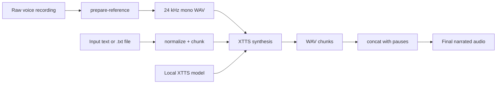
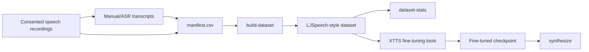

# Architecture

## Optional Fine-Tuning Data Flow

## Pipeline

1. `prepare-reference` loads the source recording with `librosa`, resamples to 24 kHz, converts to mono, optionally trims the useful segment, and writes PCM WAV.
2. `synthesize` reads inline text or a text file, normalizes whitespace and punctuation, then splits long prose into smaller chunks.
3. `XttsVoiceCloner` loads XTTS either from a local model directory or the default Coqui model name.
4. Each text chunk is synthesized with the same `speaker_wav`.
5. Chunk WAV files are concatenated with configurable paragraph and sentence pauses.

## Why Chunking Matters

Long text synthesis is more stable when split into smaller pieces. It reduces hallucinated repetitions, gives better pause control, and makes failed chunks easier to rerun.
